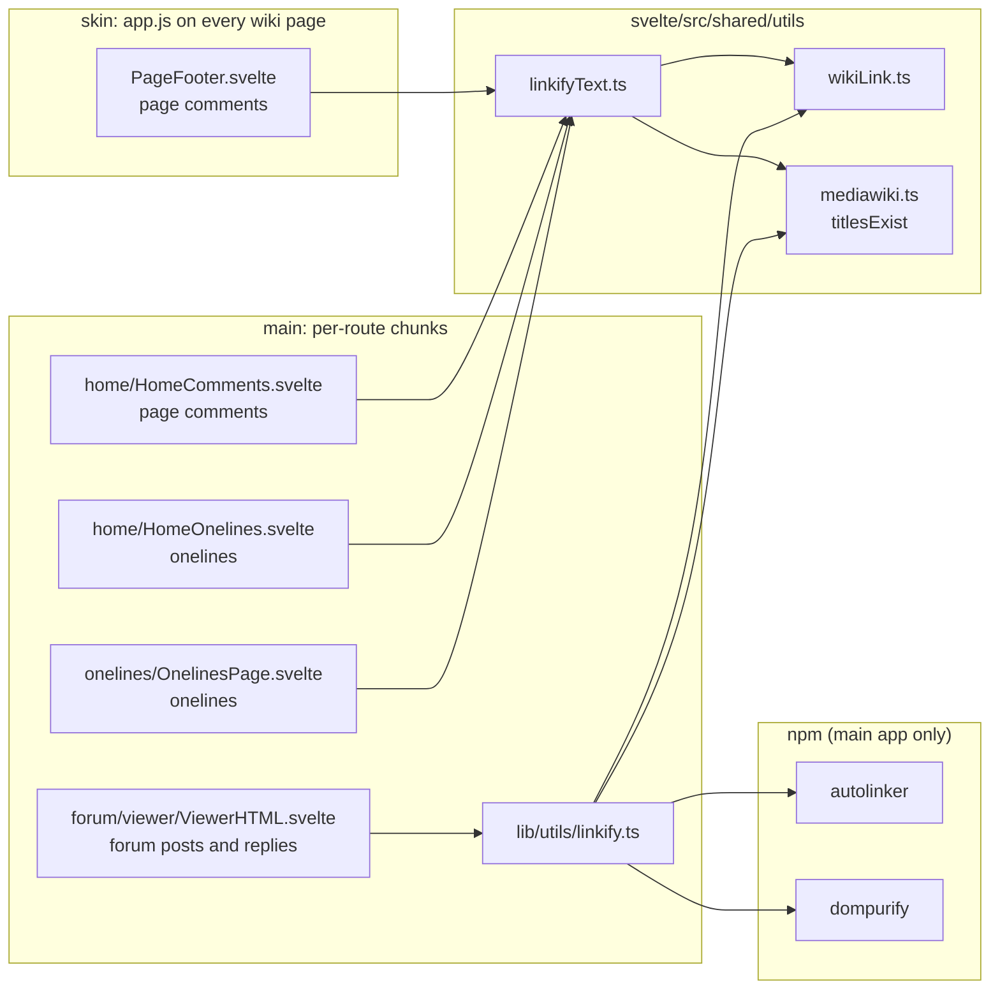

# Frontend

zengine has two Svelte apps:

- **main** (`svelte/`): SvelteKit app for the home page, forum, onelines and tools. Routes are split into chunks, so a library used by one route is downloaded only on that route.
- **skin** (`mwz/skins/ZetaSkin/svelte/`): built into a single `app.js` (IIFE) and `app.css` that every wiki page loads. Everything it imports adds to the first page view.

`svelte/src/shared/` holds code used by both; the skin sees it through the symlink `mwz/skins/ZetaSkin/svelte/src/shared`. Code used only by the main app belongs in `svelte/src/lib/`, so the skin cannot import it by accident.

## Linking user text

User text is turned into HTML with links in two ways, depending on whether the input is plain text or HTML.

| Function | Location | Input | Links | Safety |
| --- | --- | --- | --- | --- |
| `linkifyText` | `svelte/src/shared/utils/linkifyText.ts` | plain text | `http(s)://` URLs, `[[wiki links]]` | escapes the whole text, then inserts only the links it builds; no sanitizer |
| `linkify` | `svelte/src/lib/utils/linkify.ts` | HTML | URLs ([autolinker](https://github.com/gregjacobs/Autolinker.js)), `[[wiki links]]` | sanitizes the result with DOMPurify |

Imports, from the components that render user text down to the libraries:

Forum replies are rendered with `mode="text"` by `ViewerReplies.svelte` through `ViewerHTML.svelte`.

Page comments and onelines are stored as plain text (the API does not escape or sanitize them), so markup such as `<b>` is shown as text.

### linkifyText

- Escapes `& < > " '`, then links tokens. Only `http`/`https` URLs are linked, so `javascript:` and other schemes stay text.
- External links: `class="external" target="_blank" rel="nofollow ugc noopener noreferrer"`. `nofollow ugc` marks them as user-generated, like MediaWiki's `$wgNoFollowLinks`.
- A URL runs until whitespace, `<`, `>`, `"`, `'` or a backtick. It ends at its first unbalanced closing bracket, and trailing `. , ; : ! ?` are dropped: `링크(https://a.com)입니다` links `https://a.com`. Scanning resumes after the trimmed URL, so a following token is still linked. Hangul right after a URL is part of it (`https://a.com/에서`), since URLs such as `https://ko.wikipedia.org/wiki/리눅스` are common.
- Wiki links use the helpers in `svelte/src/shared/utils/wikiLink.ts` (`wikiLinkRegex`, `extractWikiTitles`, `wikiLinkHtml`), shared with `linkify`. Titles are checked in one batch with `titlesExist`, and missing pages get `class="internal new"` and an edit link. Pass all messages of a list in one `linkifyText` call so the check runs once.
- Emails and phone numbers are not linked (MediaWiki links an email only when written as `mailto:`, and a link makes the address easier to harvest).
- Tests: `svelte/src/shared/utils/linkifyText.test.ts` (`pnpm test:unit` in `svelte/`).

### linkify

Used only by the forum, where post bodies are HTML from the editor. autolinker and DOMPurify (about 80 KB minified) are dependencies of the main app only (`svelte/package.json`). The main app sets `ssr = false`, so it imports `dompurify` directly rather than `isomorphic-dompurify`, which adds jsdom for server rendering. The skin's `package.json` does not list them, so nothing in the skin can import them. The skin used them for page comments until v0.9.22, when its `app.js` went from 293 KB to 213 KB (gzip 108 KB to 77 KB).

Forum replies are plain text but still go through `linkify`, because `renderPlainTextWithFences` first turns them into HTML with code blocks.
